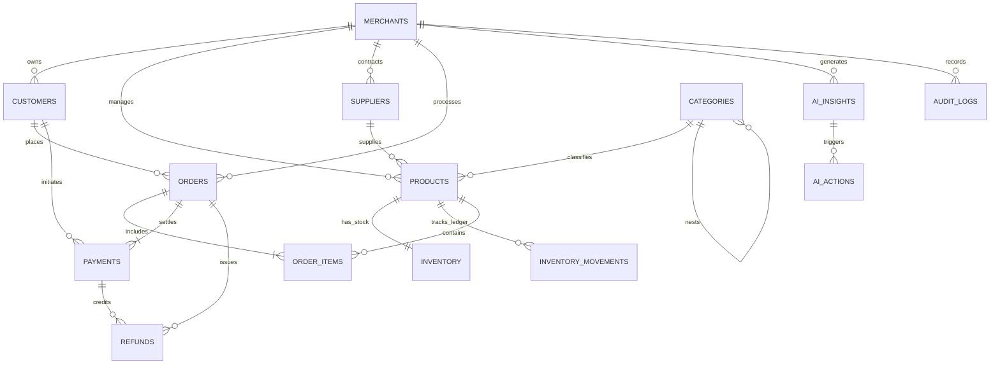

# MITRA AI — Database Architecture & Data Dictionary

## 1. Overview
The MITRA AI database is a normalized, 3NF relational schema implemented in **MySQL 8.0+**. It is designed specifically for high-throughput transactional operations combined with cross-domain telemetry analysis (Sales, Payments, Inventory, Delivery, Refunds, Customers, Suppliers, AI Insights, and Audit Logs).

## 2. Core Entity Relationship Diagram (Textual / Mermaid)



## 3. Data Dictionary

| Table | Purpose | Key Constraints & Types | Critical Indexes |
|---|---|---|---|
| `merchants` | Core multi-tenant merchant identity & risk boundaries | `max_auto_refund_limit DECIMAL(12,2)`, `currency VARCHAR(3)` | Primary Key `id` |
| `categories` | Product hierarchy | `parent_id` self-referential FK | `slug` UNIQUE |
| `suppliers` | Supplier lead times, reliability scores, payment terms | `lead_time_days INT`, `reliability_score DECIMAL(3,2)` | `city`, `reliability_score` |
| `products` | Product catalog with safety stock and reorder points | `cost_price DECIMAL(12,2)`, `selling_price DECIMAL(12,2)` | `sku` UNIQUE, `category_id`, `supplier_id` |
| `inventory` | Real-time stock levels (available, reserved, incoming) | `current_stock INT`, `reserved_stock INT` | `product_id` UNIQUE, `(current_stock, reserved_stock)` |
| `inventory_movements` | Immutable audit ledger of all stock additions/reductions | `movement_type ENUM`, `quantity INT`, `balance_after INT` | `(product_id, created_at)`, `(reference_type, reference_id)` |
| `customers` | Customer master with segmentation (NEW, REGULAR, LOYAL, AT_RISK) | `total_spend DECIMAL(12,2)`, `segment ENUM` | `email` UNIQUE, `segment`, `(city, state)`, `last_order_date` |
| `orders` | Transaction records, delivery promises, carrier tracking | `total_amount DECIMAL(12,2)`, `delivery_status ENUM` | `order_number` UNIQUE, `order_date`, `(shipping_city, delivery_status)` |
| `order_items` | Line items per order | `unit_price DECIMAL(12,2)`, `unit_cost DECIMAL(12,2)` | `(product_id, order_id)` |
| `payments` | Gateway transactions, Razorpay webhook mapping, failure reasons | `status ENUM`, `failure_reason ENUM`, `amount DECIMAL(12,2)` | `(status, initiated_at)`, `(failure_reason, initiated_at)` |
| `refunds` | Refund transactions tied to order, payment, and reason codes | `amount DECIMAL(12,2)`, `reason_code ENUM` | `(order_id, payment_id)`, `(reason_code, created_at)` |
| `ai_insights` | Autonomous findings with cross-domain causal chains & evidence | `cross_domain_chain JSON`, `evidence_payload JSON`, `confidence_score DECIMAL(4,3)` | `(domain, severity)`, `(status, detected_at)`, `scenario_code` |
| `ai_actions` | Bounded policy actions with human approval states | `risk_level ENUM`, `status ENUM`, `parameters JSON` | `(status, risk_level)`, `action_type`, `created_at` |
| `audit_logs` | Immutable audit trail for system, AI, and human actions | `actor_type ENUM`, `old_values JSON`, `new_values JSON` | `(entity_name, entity_id)`, `(actor_type, actor_identifier)` |

## 4. Analytical Views (`views.sql`)
1. **`v_daily_sales_performance`**: Aggregates daily orders, gross revenue, AOV, cancellations.
2. **`v_payment_failure_rates_daily`**: Hourly/daily gateway failure spikes and reasons.
3. **`v_product_stockout_risk`**: Real-time sales velocity (14-day) vs days-of-stock-remaining vs supplier lead time.
4. **`v_regional_delivery_delays`**: City-wise delay rates and days past promised date.
5. **`v_product_refund_rates`**: SKU-level refund rates correlated with delivery delays and quality issues.
6. **`v_customer_churn_risk_cohort`**: Loyal/regular customers suffering repeated payment failures and declining activity.

## 5. How to Run & Apply
```bash
# Apply schema and views
mysql -u root -p < database/schema.sql
mysql -u root -p < database/views.sql
mysql -u root -p < database/seed.sql

# Or using the automated Node.js reset script:
npm run db:reset
```
