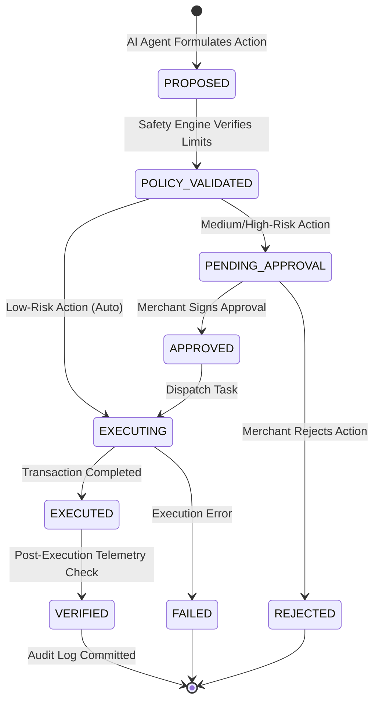

# MITRA AI — AI Agent Architecture & Reasoning Protocol

## 1. Core Agent Paradigm
Unlike a generic chatbot that produces unstructured chat text, MITRA AI operates as an **Autonomous Diagnostic Business Engine**. It strictly executes:

```
Telemetry Query Tools ──▶ Anomaly Identification ──▶ Causal Chain Graph ──▶ Policy Guardrail Check ──▶ Action Proposal
```

---

## 2. Parameter-Bounded Analytical Tools

The AI Agent never executes arbitrary SQL statements. Instead, it utilizes controlled, parameter-validated analytical tools:

| Tool Function | Domain | Description |
|---|---|---|
| `get_sales_trends(startDate, endDate, categoryId)` | Sales | Aggregated gross revenue, AOV, order volume, and cancellation rates. |
| `get_payment_failure_analysis(startDate, endDate)` | Payments | Breakdown of payment attempts, failure rates, and error codes (`BANK_TIMEOUT`, etc.). |
| `get_inventory_stockout_risks(riskStatus, limit)` | Inventory | Products with critical stockout risk based on 14-day velocity vs lead time. |
| `get_regional_delivery_bottlenecks(minDelayRate)` | Logistics | Regional carrier delay rates and promised date breaches. |
| `simulate_price_change_impact(productId, pctChange)` | Simulation | Counterfactual price elasticity and margin simulation. |

---

## 3. Two-Tier AI Action Lifecycle & Policy State Machine



### Risk Classification Matrix:
- **`LOW` (Auto-Executable)**: Carrier notification tickets, routing fallback switches, customer recovery SMS campaigns.
- **`MEDIUM` (Approval Recommended)**: Supplier purchase orders $\le ₹25,000$, defective batch stock quarantine, customer goodwill refunds $\le ₹2,000$.
- **`HIGH` (Approval Mandatory)**: Price changes $> 10\%$, reorders $> ₹25,000$, account configuration changes.

---

## 4. Structured JSON Output Schema Contract

Every insight produced by the agent conforms to this strict JSON contract:

```json
{
  "insight_title": "String",
  "domain": "SALES | PAYMENTS | INVENTORY | DELIVERY | REFUNDS | CUSTOMERS | SUPPLIERS | CROSS_DOMAIN",
  "severity": "INFO | LOW | MEDIUM | HIGH | CRITICAL",
  "executive_summary": "1-2 sentence executive briefing",
  "root_cause_hypothesis": {
    "primary_factor": "String",
    "contributing_factors": ["String"],
    "evidence_citations": ["Query reference and numeric delta"]
  },
  "cross_domain_chain": [
    { "domain": "String", "observation": "String", "metric_value": "String" }
  ],
  "estimated_financial_impact_inr": 320000.00,
  "confidence_score": 0.920,
  "recommended_actions": [
    {
      "action_type": "SWITCH_PAYMENT_ROUTING",
      "risk_level": "LOW",
      "parameters": {
        "downgrade_route": "HDFC_DIRECT_NETBANKING",
        "fallback_route": "UPI_AND_CARDS_DEFAULT"
      },
      "expected_outcome": "Prevent ₹65,000 daily dropped checkout volume"
    }
  ]
}
```
