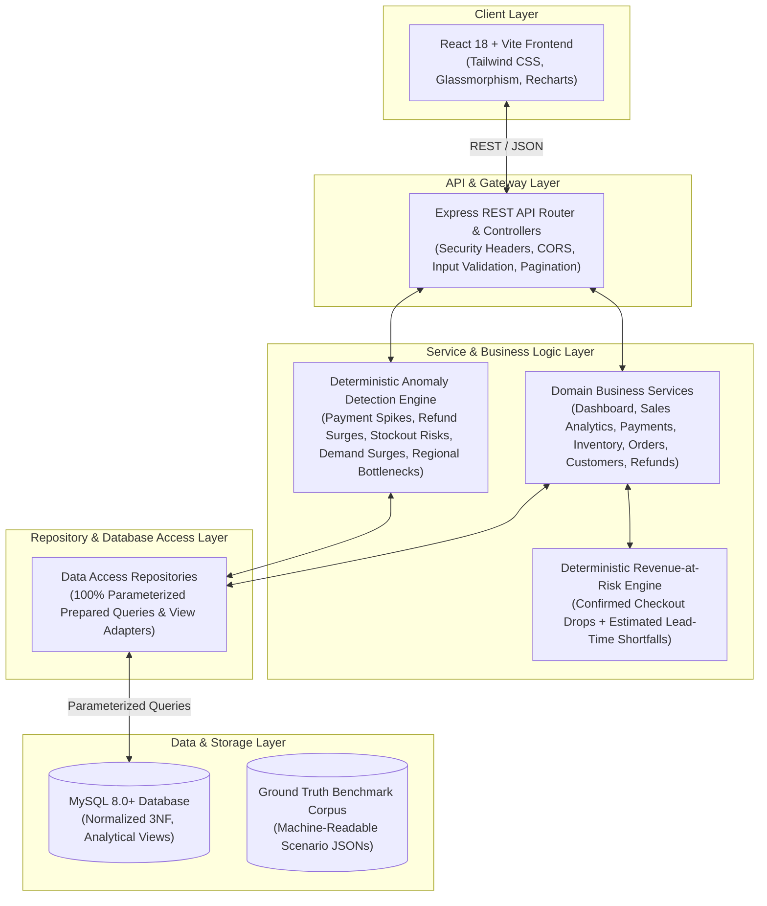
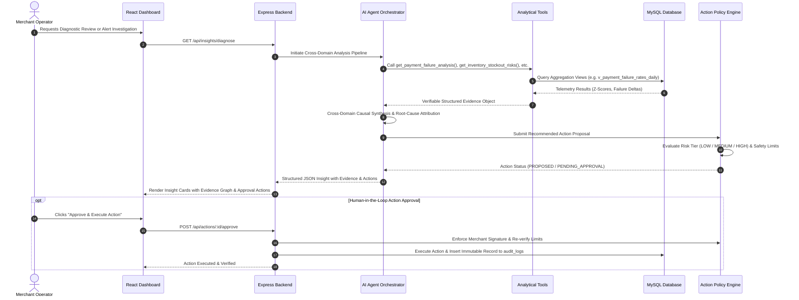

# MITRA AI — System Architecture & Technical Blueprint

## 1. Executive Summary & Core Philosophy

**MITRA AI** is an autonomous, explainable AI-powered merchant operating system built for modern e-commerce and retail merchants. Traditional BI systems only display backward-looking charts, requiring business operators to manually guess correlations. Mitra AI proactively investigates cross-domain operational telemetry across:

$$\text{Sales} \longleftrightarrow \text{Payments} \longleftrightarrow \text{Inventory} \longleftrightarrow \text{Logistics} \longleftrightarrow \text{Refunds} \longleftrightarrow \text{Suppliers} \longleftrightarrow \text{Customers}$$

It discovers non-obvious business anomalies, establishes verifiable causal links, quantifies financial loss, simulates counterfactuals, and executes policy-bounded or human-approved corrective actions with an immutable audit trail.

```
DATA ──▶ ANALYTICS ──▶ EVIDENCE GRAPH ──▶ AI REASONING ──▶ POLICY ENGINE ──▶ ACTION ──▶ VERIFICATION ──▶ AUDIT
```

---

## 2. High-Level System Architecture (C4 Container Diagram)



---

## 3. Detailed Data & Reasoning Pipeline



---

## 4. Cross-Domain Causal Graph & Evidence Formulation

Mitra AI does not use an LLM to guess numeric values. Instead:
1. **Statistical Anomaly Filtering**: Pre-computed database views identify statistical outliers ($Z > 2.5$ or $> 20\%$ variance from baseline).
2. **Evidence Linking**: Correlated anomalies across separate business domains are combined into an Evidence Object:
   - *Example*: Symptom: Bhopal Refund Spike (19.4%) $\rightarrow$ Evidence: Courier SLA breach ($>6$ days delay) $\rightarrow$ Root Cause: Bhopal Hub Logistics regional bottleneck.
3. **Structured Agent Synthesis**: The LLM consumes this structured evidence object and returns strict JSON adhering to schema contracts.
4. **Deterministic Evaluation**: Every finding is benchmarked against `data/ground_truth/` to prevent hallucinations.

---

## 5. Multi-Tier Safety & Action Policy Architecture

| Tier | Risk Level | Description | Execution Policy | Example Action |
|---|---|---|---|---|
| **Tier 1** | `LOW` | Read-only operations, carrier notices, recovery campaigns | Automated execution with logging | Reroute payment gateway fallback, Send customer apology SMS |
| **Tier 2** | `MEDIUM` | Operational adjustments within standard safety bounds | Optional human approval | Reorder inventory below ₹25,000 threshold, Quarantine defective batch |
| **Tier 3** | `HIGH` | Financial transactions, price changes, large purchase orders | **Mandatory Human Signature Required** | Price adjustments $>10\%$, Supplier restock $>₹25,000$, Bulk refunds |

---

## 6. Project Monorepo Layout

```
mitra-ai/
├── frontend/             # React 18 + Vite + Tailwind CSS User Interface
├── backend/              # Node.js + Express.js API & AI Reasoning Engine
├── database/             # Normalized MySQL schema, views, and seed data
├── data/                 # Seeded synthetic datasets and machine-readable ground truth
├── scripts/              # Dataset generator, database seeder, and benchmark runner
└── docs/                 # Complete architecture, database, AI, and security documentation
```
