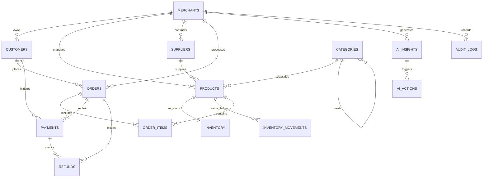

# MITRA AI — Database Architecture & Data Dictionary

## 1. Relational Schema Design
The MITRA AI database is normalized (3NF) and implemented on **MySQL 8.0+**. It enforces strict transactional integrity, foreign key references, decimal arithmetic for monetary figures, and comprehensive composite indexing.

## 2. Complete Entity Relationship Diagram

---

## 3. Data Dictionary

### 3.1 `merchants`
Multi-tenant identity and merchant-configured safety guardrails.
- `id` (INT UNSIGNED, PK, AI)
- `name` (VARCHAR(150), NOT NULL)
- `currency` (VARCHAR(3), DEFAULT 'INR')
- `max_auto_refund_limit` (DECIMAL(12,2), DEFAULT 2000.00)
- `max_auto_reorder_limit` (DECIMAL(12,2), DEFAULT 25000.00)
- `max_auto_price_adjust_pct` (DECIMAL(5,2), DEFAULT 10.00)

### 3.2 `categories`
Hierarchical product classification.
- `id` (INT UNSIGNED, PK, AI)
- `name` (VARCHAR(100), NOT NULL)
- `slug` (VARCHAR(120), UNIQUE)
- `parent_id` (INT UNSIGNED, NULL, FK -> categories.id)

### 3.3 `suppliers`
Supplier fulfillment performance metrics.
- `id` (INT UNSIGNED, PK, AI)
- `name` (VARCHAR(150), NOT NULL)
- `city` (VARCHAR(100), NOT NULL)
- `lead_time_days` (INT UNSIGNED, NOT NULL DEFAULT 7)
- `reliability_score` (DECIMAL(3,2), NOT NULL DEFAULT 0.95)

### 3.4 `products`
Product catalog and inventory reorder thresholds.
- `id` (INT UNSIGNED, PK, AI)
- `sku` (VARCHAR(64), NOT NULL UNIQUE)
- `name` (VARCHAR(255), NOT NULL)
- `cost_price` (DECIMAL(12,2), NOT NULL)
- `selling_price` (DECIMAL(12,2), NOT NULL)
- `reorder_point` (INT UNSIGNED, NOT NULL DEFAULT 20)
- `reorder_quantity` (INT UNSIGNED, NOT NULL DEFAULT 100)
- `safety_stock` (INT UNSIGNED, NOT NULL DEFAULT 10)
- `lead_time_days` (INT UNSIGNED, NOT NULL DEFAULT 7)

### 3.5 `inventory`
Real-time stock state per location/SKU.
- `product_id` (INT UNSIGNED, NOT NULL UNIQUE, FK -> products.id)
- `current_stock` (INT, NOT NULL DEFAULT 0)
- `reserved_stock` (INT, NOT NULL DEFAULT 0)
- `incoming_stock` (INT, NOT NULL DEFAULT 0)

### 3.6 `inventory_movements`
Immutable audit ledger of stock transactions.
- `movement_type` (ENUM: 'PURCHASE', 'SALE', 'RETURN', 'ADJUSTMENT', 'DAMAGE', 'RESTOCK')
- `quantity` (INT, NOT NULL)
- `balance_after` (INT, NOT NULL)
- `reference_type` (VARCHAR(50), NOT NULL)
- `reference_id` (VARCHAR(100))

### 3.7 `customers`
Customer profiling and lifetime value tracking.
- `customer_code` (VARCHAR(64), NOT NULL UNIQUE)
- `segment` (ENUM: 'NEW', 'REGULAR', 'LOYAL', 'AT_RISK')
- `total_orders_count` (INT UNSIGNED, DEFAULT 0)
- `total_spend` (DECIMAL(12,2), DEFAULT 0.00)
- `last_order_date` (TIMESTAMP, NULL)

### 3.8 `orders`
E-commerce orders and carrier delivery tracking.
- `order_number` (VARCHAR(64), NOT NULL UNIQUE)
- `subtotal` (DECIMAL(12,2), NOT NULL)
- `discount_amount` (DECIMAL(12,2), DEFAULT 0.00)
- `tax_amount` (DECIMAL(12,2), DEFAULT 0.00)
- `total_amount` (DECIMAL(12,2), NOT NULL)
- `status` (ENUM: 'PENDING', 'CONFIRMED', 'SHIPPED', 'DELIVERED', 'CANCELLED')
- `delivery_status` (ENUM: 'PENDING', 'IN_TRANSIT', 'DELIVERED', 'DELAYED', 'FAILED')
- `promised_delivery_date` (DATE, NULL)
- `actual_delivery_date` (DATE, NULL)

### 3.9 `order_items`
Line items per order.
- `order_id` (BIGINT UNSIGNED, FK -> orders.id)
- `product_id` (INT UNSIGNED, FK -> products.id)
- `quantity` (INT UNSIGNED, NOT NULL)
- `unit_price` (DECIMAL(12,2), NOT NULL)
- `unit_cost` (DECIMAL(12,2), NOT NULL)
- `total_price` (DECIMAL(12,2), NOT NULL)

### 3.10 `payments`
Payment transactions with gateway-level error taxonomy.
- `gateway` (VARCHAR(50), DEFAULT 'RAZORPAY')
- `amount` (DECIMAL(12,2), NOT NULL)
- `status` (ENUM: 'SUCCESS', 'FAILED', 'PENDING', 'REFUNDED', 'PARTIALLY_REFUNDED')
- `failure_reason` (ENUM: 'NONE', 'BANK_TIMEOUT', 'INSUFFICIENT_FUNDS', 'NETWORK_ERROR', 'CARD_DECLINED', 'GATEWAY_ERROR', 'UNKNOWN')
- `error_code` (VARCHAR(50), NULL)
- `payment_method` (VARCHAR(50), DEFAULT 'UPI')

### 3.11 `refunds`
Refund requests mapped to order, payment, and return reason codes.
- `payment_id` (BIGINT UNSIGNED, FK -> payments.id)
- `amount` (DECIMAL(12,2), NOT NULL)
- `reason_code` (ENUM: 'DELIVERY_DELAY', 'DAMAGED_PRODUCT', 'WRONG_ITEM', 'CUSTOMER_CANCELLATION', 'POOR_QUALITY', 'OTHER')

### 3.12 `ai_insights`
Autonomous AI anomaly discoveries with attached cross-domain evidence chains.
- `insight_uuid` (VARCHAR(64), UNIQUE)
- `domain` (ENUM)
- `severity` (ENUM: 'INFO', 'LOW', 'MEDIUM', 'HIGH', 'CRITICAL')
- `root_cause_hypothesis` (TEXT, NOT NULL)
- `cross_domain_chain` (JSON, NOT NULL)
- `evidence_payload` (JSON, NOT NULL)
- `estimated_financial_impact` (DECIMAL(12,2), DEFAULT 0.00)
- `confidence_score` (DECIMAL(4,3), DEFAULT 0.850)

### 3.13 `ai_actions`
Bounded actions generated by AI, subject to safety policy checks.
- `action_uuid` (VARCHAR(64), UNIQUE)
- `action_type` (ENUM)
- `risk_level` (ENUM: 'LOW', 'MEDIUM', 'HIGH')
- `parameters` (JSON, NOT NULL)
- `status` (ENUM: 'PROPOSED', 'POLICY_VALIDATED', 'PENDING_APPROVAL', 'APPROVED', 'REJECTED', 'EXECUTED', 'FAILED', 'VERIFIED')
- `requires_human_approval` (BOOLEAN, DEFAULT TRUE)
- `approved_by_user` (VARCHAR(100), NULL)

### 3.14 `audit_logs`
Immutable compliance and action ledger.
- `actor_type` (ENUM: 'SYSTEM', 'AI_AGENT', 'MERCHANT_USER', 'API_INTEGRATION')
- `actor_identifier` (VARCHAR(120), NOT NULL)
- `action_name` (VARCHAR(100), NOT NULL)
- `entity_name` (VARCHAR(60), NOT NULL)
- `entity_id` (VARCHAR(100), NOT NULL)
- `old_values` (JSON, NULL)
- `new_values` (JSON, NULL)
- `created_at` (TIMESTAMP, NOT NULL)
