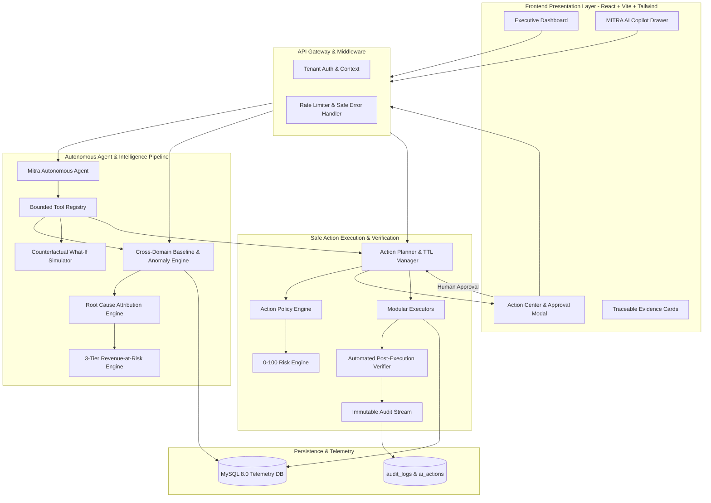

# MITRA AI — Technical Architecture & System Specification

## 1. High-Level Architecture Diagram

---

## 2. Core Subsystems

### 2.1 Cross-Domain Intelligence Engine
- **Baselines**: Calculates rolling 30-day moving averages and standard deviations.
- **Anomaly Detection**: Evaluates statistical z-scores and threshold deviations across Payments, Inventory, Logistics, Refunds, and Customers.
- **Root-Cause Attribution**: Ranks candidate causes using confidence weights ($0.0 - 1.0$).
- **Impact Quantification**: Separates revenue loss into 3 tiers:
  - **Confirmed**: Dropped checkout transaction volumes.
  - **Estimated**: Lead-time stockout shortfall gaps ($\text{Daily Velocity} \times \text{Shortfall Days} \times \text{Price}$).
  - **Potential**: Behavioral cohort churn risk.

### 2.2 Autonomous AI Agent
- Powered by OpenAI Function Calling or deterministic offline fallbacks.
- Operates under strict `MAX_AGENT_STEPS = 6` to avoid infinite tool loops.
- All conclusions are grounded in structured tool outputs with evidence citations.

### 2.3 Policy & Risk Governance Engine
- **Risk Scoring**: 0–100 formula categorizing actions into `LOW`, `MEDIUM`, `HIGH`, and `CRITICAL`.
- **Anti-Self-Approval**: AI agents cannot approve their own action proposals.
- **Two-Step Approval**: High and Critical risk operations require mandatory operator justification text and confirmation checkboxes.
- **Idempotency Guard**: Idempotency keys prevent duplicate database mutations from network replays.
- **Post-Execution Verification**: Runs automated persistence and integrity checks before moving to `VERIFIED` status.
